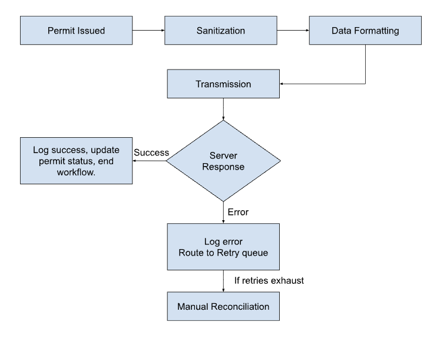

# Deliverable 3: Integration Risk Assessment — Public GIS Map

## 1. Pre-Spec Readiness Questions

- **Dependency:** Do we have a funded, scheduled technical contact at the IT contractor right now?
- **Documentation:** When will the contractor share their technical specification so we can check if the connection will actually work, and how will they warn us if the specs change before go-live?
- **Sandbox:** Does the contractor have an isolated staging environment for non-prod testing?
- **Security:** Has City IT officially approved the authentication protocols for this external connection?
- **Authority:** If the contractor's server cannot support the promised volume, who holds authority to modify the go-live commitment?

## 2. Risk Escalations

**PM-Facing (Schedule & Budget):**
- **QA Compression:** Contractor documentation delays compress our testing window from months to weeks. PM must track this dependency; only the PM can leverage a contractor delay to push back the fixed go-live date.
- **Resource Burn:** Contractor refusal to provide documentation forces our engineers to reverse-engineer API endpoints. Explicitly exclude reverse-engineering from our resource forecast.

**Client-Facing (Liability & Politics):**
- **Data Exposure (PII):** Public-facing map creates PII risk (addresses, valuations). The City — not the contractor — owns the data. No connection opens until a designated City data authority signs off on payload structure.
- **Fallback Framework:** The Planning Director's go-live commitment depends entirely on the IT contractor's readiness. Pre-negotiate a phased delivery fallback now so the Director can control the narrative if the contractor's server fails.

## 3. Workflow Diagram

The workflow shows the outbound integration path: Permit Issued → Sanitization (strips fields not approved for public disclosure) → Data Formatting (translates to the external GIS map's required format) → Transmission (sends data to the IT contractor's server) → Server Response. On success, the system logs the outcome and updates the permit status. On error, the system logs the failure, routes to a retry queue, alerts City IT, and auto-retries three times. If retries exhaust, the record is flagged for manual reconciliation, the dashboard is alerted, and publish is blocked.

## 4. Integration Validation Timeline (Pre-UAT)

- **Month 1 (Proof of Connection):** Verify we can securely connect to the contractor's server and push a single test record. If this baseline fails, we pause development and escalate immediately.
- **Month 2 (The Data Contract):** Freeze the exact data mapping, security rules, and performance limits in writing with the contractor. This document becomes the absolute standard for all future tests.
- **Months 2-3 (Internal Resilience Testing):** Test our system's error-handling internally. We simulate connection drops and timeouts to prove our retry-queue holds the data safely without crashing.
- **Month 4 (Staging Alignment):** Connect to the contractor's actual staging environment. This flushes out any undocumented behavior where the contractor's system doesn't match their written contract.
- **Months 5-6 (End-to-End Simulation):** Push a fully formatted, sanitized permit from our system all the way to the staging map. We verify the location plots correctly and the exact approved fields display.
- **The Pre-UAT Gate:** We do not use the customer to find integration bugs. UAT does not begin until the data contract is locked and the end-to-end staging simulation passes 100%.

## 5. Decision Documentation Framework

Governance scales with the weight of the decision:

- **Operational (Low Risk):** Logged in meeting minutes. No formal sign-off required.
- **Scope & Timeline (High Risk):** Requires explicit, written confirmation from the City Sponsor.
- **Verbal Technical Limits:** I document these as project assumptions to ensure alignment. After technical calls, I email the contractor and PM: *"Confirming our integration design aligns with the [50 requests/min] limit discussed today. Please let me know if this needs any adjustment."* This forces the vendor to own their constraints in writing and protects our timeline.
